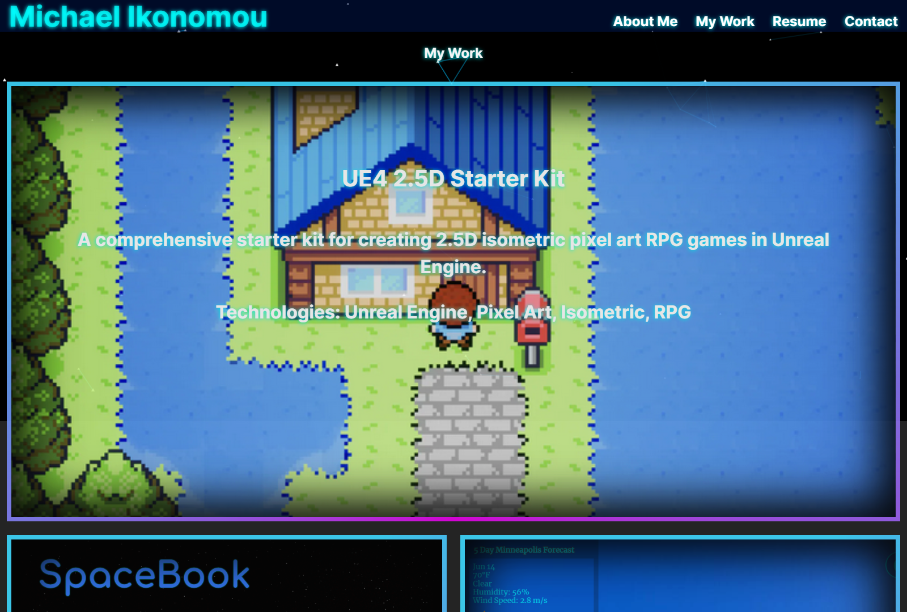

#Portfolio

## Table of Contents
 - [Description](#description)
 - [Installation](#installation)
 - [Usage](#usage)
 - [Credits](#credits)
 - [Contributing](#contributing)
 - [Contact](#contact)
 - [License](#license)

## Description
I wanted to showcase my understanding of react and create one place where someone can view my works, read about me, and contact me for any potential work. I wanted to style it with a modern look that's pleasing  
and pushes the performance capabilities of the site. Using ReactTSParticles, I have styled the background with floating particles that gravitate to your mouse slowly and create more particles when the page is clicked. I've combined what I've learned of CSS and styling to ensure that my site's components and elements each have a non-vanilla style to them, and I'm very pleased with the result.

## Installation
No installation is necessary, just have a poke around!

## Usage
Head over to this deployment link to check out the page:  [HERE](https://main--reactjsxportfolio.netlify.app)

## Credits
Github's icon for repo links.

## Contributing
Be good and do code.

- GitHub Profile: [IkonicRes](https://github.com/IkonicRes)

- For additional questions, reach out to IkonicResonance@gmail.com.

## Contact

Preferred method of communication: Email

## License

